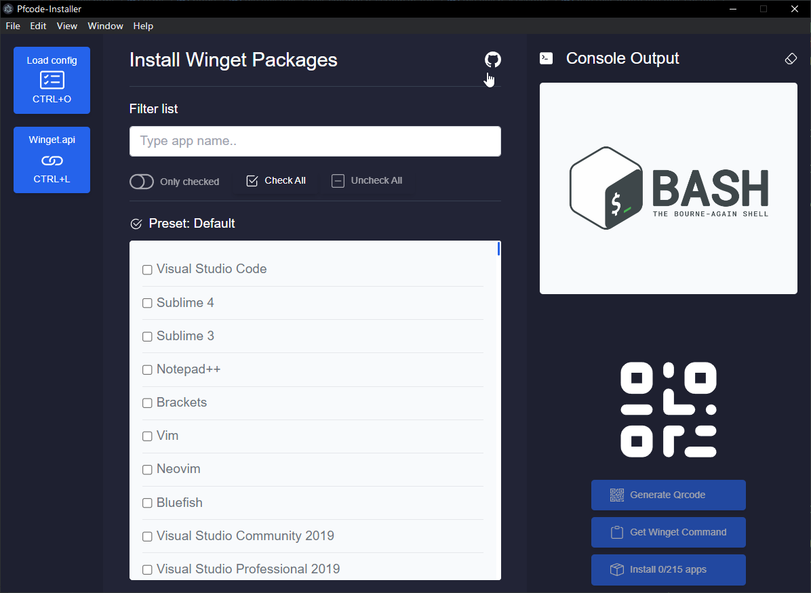
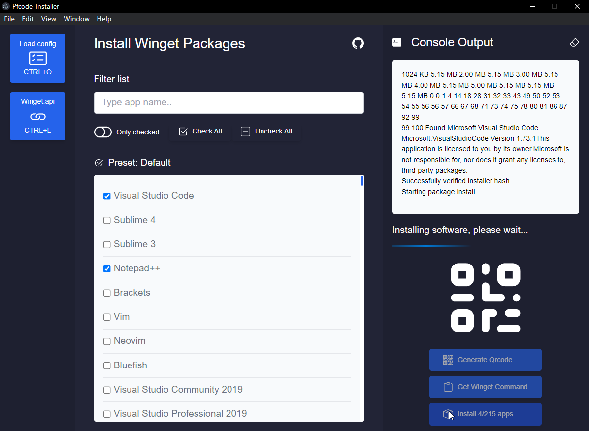
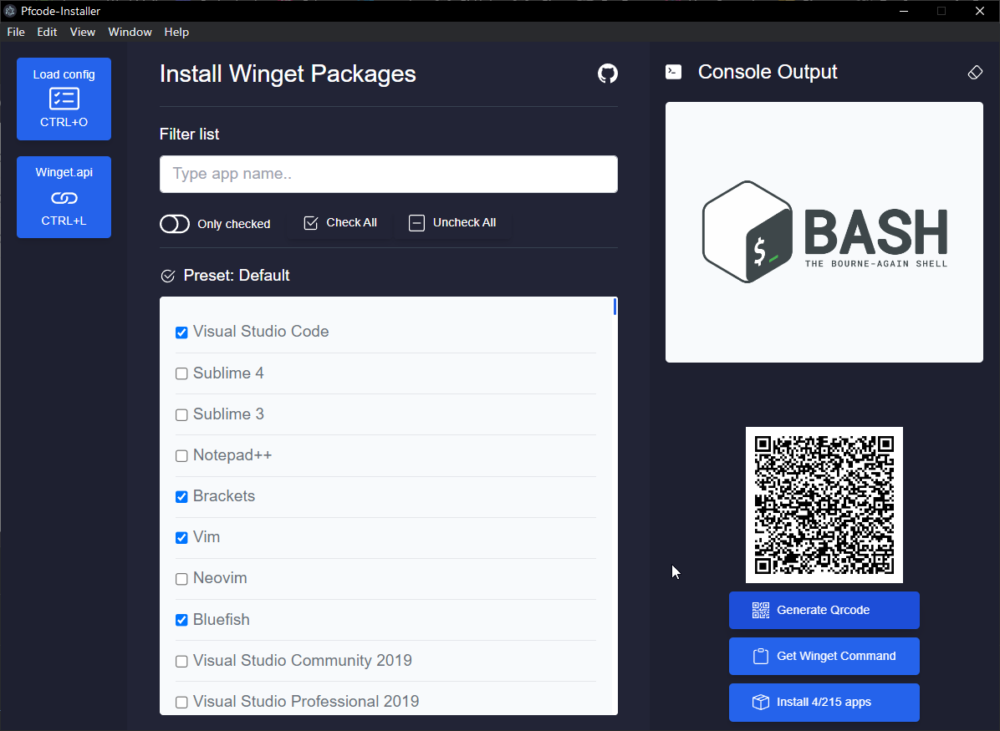

# Pfcode Installer - Electron

Pfcode Installer is an electron app which allow you to install packages via the Windows package management, Winget on a GUI.

The app is only meant to work on Windows 11 by default and Windows 10 (require to install winget first)

### App functionality

- Select from a wide range of apps 200+
- Console Output
- Clear console output
- Load custom app config (json)
- Generate QR code (maximum selected apps, 25)
- Generate install command to clipoard to use on cmd.exe
- Filter apps by name
- Show only checked apps
- Check all apps with one click
- Uncheck all apps with one click

# Installing packages

# Filtering apps

# Qrcode

