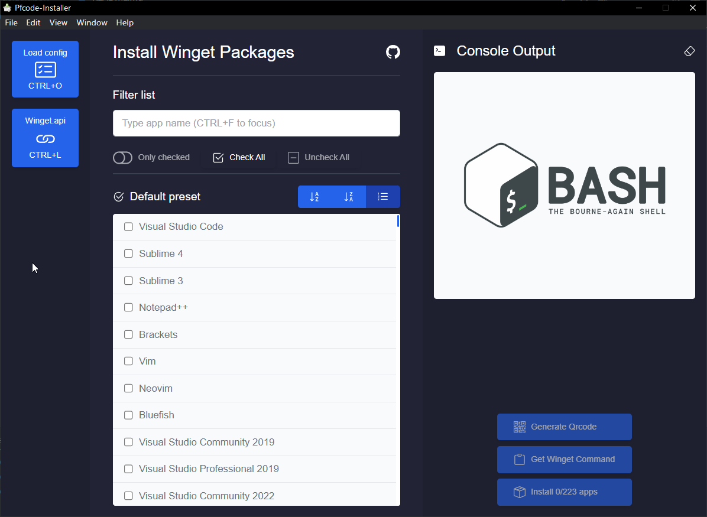
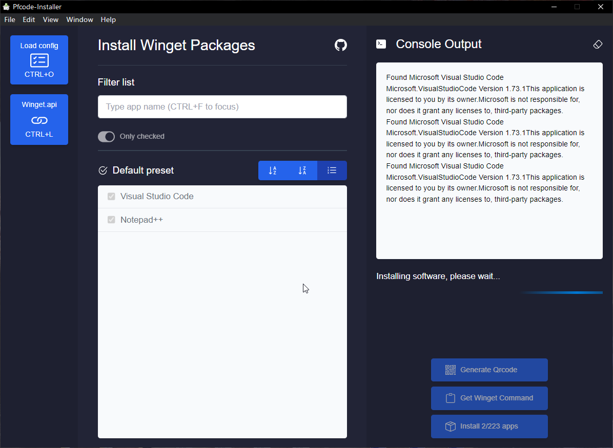
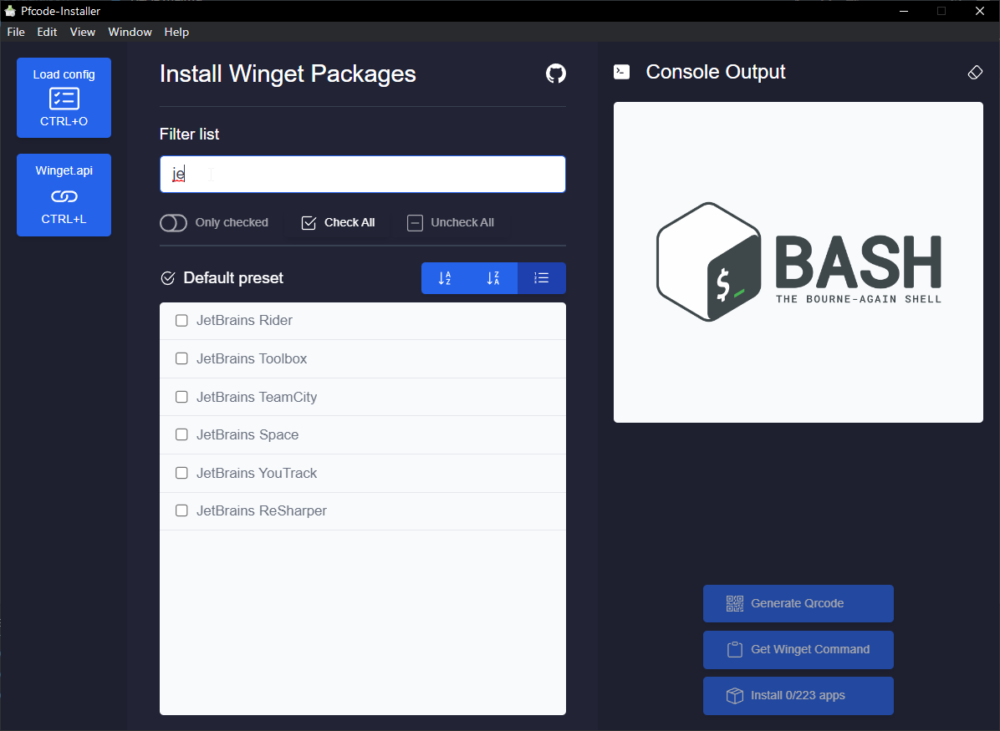
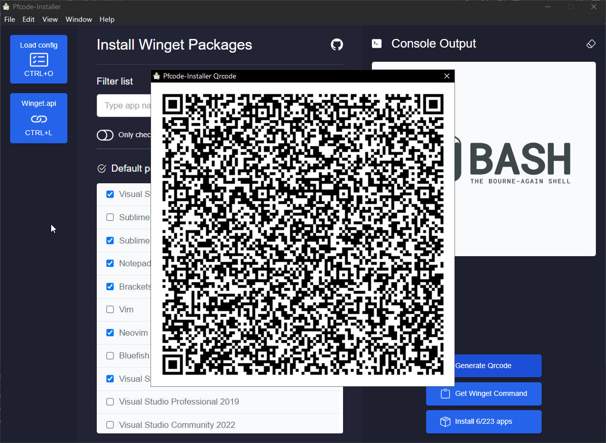

# Pfcode Installer - Electron

Pfcode Installer is an electron app which allow you to install packages via the Windows package management, Winget on a GUI.

The app is only meant to work on Windows 11 by default and Windows 10 (require to install winget first)

### App functionality

- Select from a wide range of apps 220+
- Load custom app config (json)
- 7 preset ready to use
- Sort app by AZ, ZA, ID
- Console Output
- Generate QR code (maximum selected apps, 25)
- Generate install command to clipoard to use on powershell
- Filter apps by name
- Check, uncheck all apps in a click
- Show only checked apps
- Keyboard shortcuts

https://user-images.githubusercontent.com/4368630/205447271-959224b9-a42e-461b-991b-4e99ba985ee6.mp4



# Installing packages



# Filtering apps



# Qrcode



# How to use

```shell

# Install node dependencies

npm i

# Run app styles

npm run style

# Run the app

npm start

# Create portable executable

npm run packager

```

