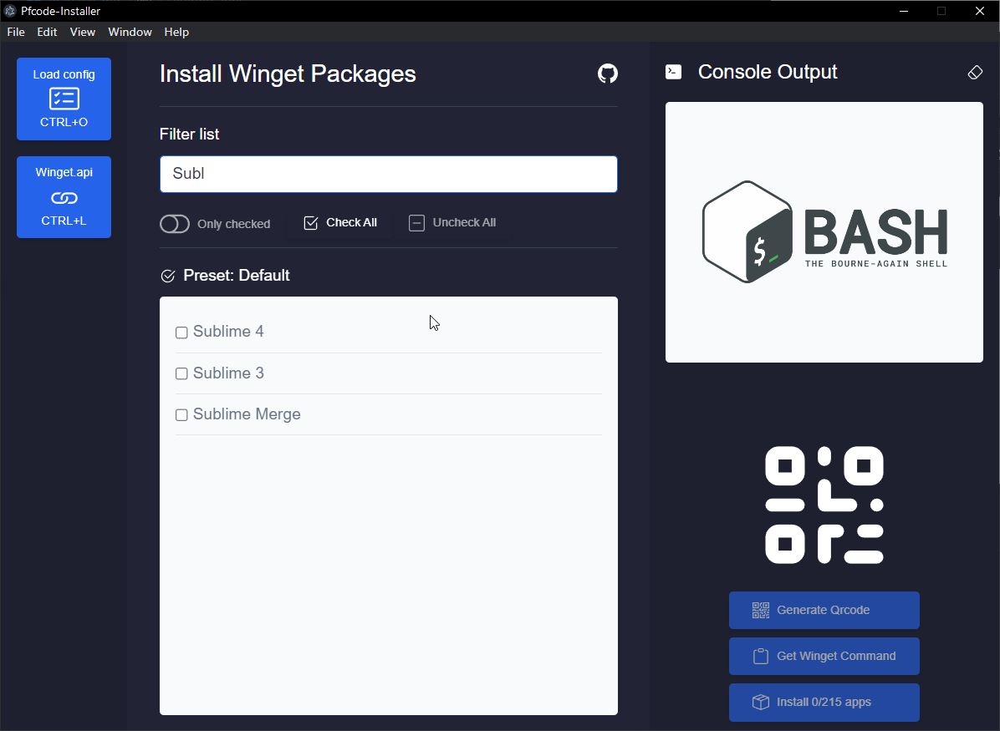

# Pfcode Installer - Electron

Functionality:

- Select from a wide range of apps 200+
- Console Output
- Clear console output
- Load custom json config
- Generate QR code (support max 25 apps)
- Generate install command to clipoard to use on cmd.exe
- Filter apps by name
- Show only checked apps
- Check all apps
- Unchecl all apps

# Installing packages

# Filtering apps

# Qrcode

